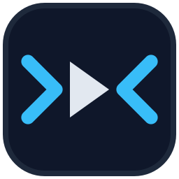
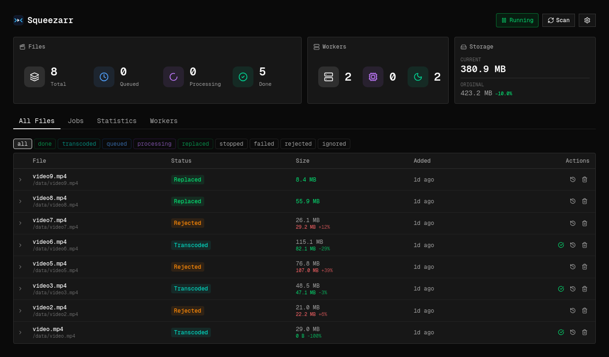
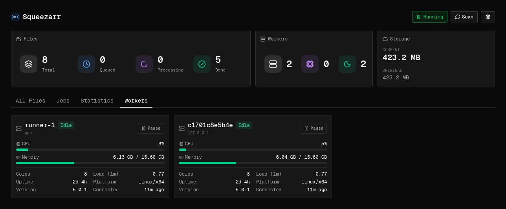
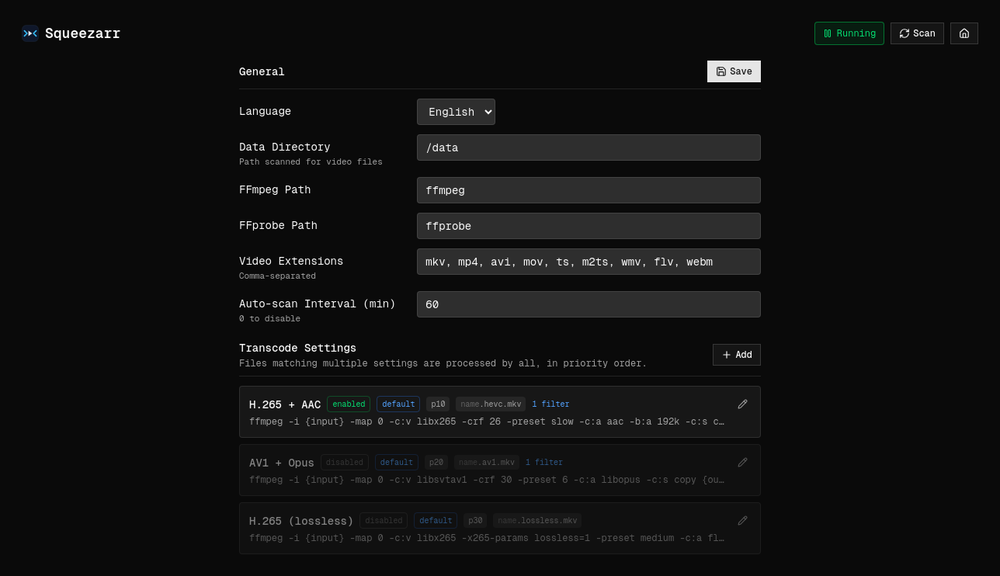

<div align="center">



# Squeezarr

**Self-hosted video transcoding manager.** Point it at a media library and it scans,
probes, and transcodes files with `ffmpeg` according to rules you configure — then lets
you review and apply the results from a clean dashboard.


</div>

---

## Features

- 🎬 **Automated** — drop files in your media directory; Squeezarr scans, probes, and
  transcodes them for you.
- 🧩 **Rule-driven** — you decide which files get transcoded and how, with configurable
  per-codec/format settings. Non-matching files are left untouched.
- 🖥️ **Dashboard** — review files, jobs, storage savings, and transcode workers; pause a
  single worker or the whole pipeline with one click.
- ↔️ **Safe by default** — keep the transcode beside the original, or replace it in place.
- 📈 **Scales with your hardware** — add worker containers to transcode more files at once.
- 📦 **One container** — ships with its own database; no external services to set up.

## Screenshots

The dashboard — files, queue and worker stats, storage savings, and per-file transcode results:



Transcode workers, with live CPU/memory and per-worker pause:



Settings — general options and the rule-driven transcode profiles:



## Requirements

- **Docker** or **Podman** — the image bundles everything it needs (Node, `ffmpeg`, and the
  database).
- A directory of video files to point it at.

## Configuration

| Variable                 | Required on      | Purpose                                                            |
| ------------------------ | ---------------- | ------------------------------------------------------------------ |
| `SQUEEZARR_PASSWORD`     | Main             | Admin password for the web UI and API.                             |
| `SQUEEZARR_RUNNER_TOKEN` | Main and runners | Authorizes runner WebSocket connections.                           |
| `HOST_IP`                | Runner only      | Hostname or IP address of the main instance.                       |
| `MONITOR_PORT`           | Runner only      | Main-instance port when it differs from the default `3000`.        |
| `NODE_NAME`              | Main or runner   | Friendly name shown in the Workers view; defaults to the hostname. |

Use different values for `SQUEEZARR_PASSWORD` and `SQUEEZARR_RUNNER_TOKEN`. Runner-only
instances need the runner token but must not receive the admin password.

### Storage

- **`/config`** stores the database and application settings. Persist it only on the main instance.
  A named volume is recommended for a clean installation.
- **`/data`** contains the media library. The main instance and every runner must see the same
  files at the same paths.

## Installation

Most users should deploy the published `voidversexyz/squeezarr:latest` image.

### Docker Compose

#### Main instance

Create a `compose.yaml`:

```yaml
services:
    squeezarr:
        image: voidversexyz/squeezarr:latest
        ports:
            - "3000:3000"
        environment:
            SQUEEZARR_PASSWORD: "<choose-an-admin-password>"
            SQUEEZARR_RUNNER_TOKEN: "<choose-a-runner-token>"
        volumes:
            - squeezarr-config:/config
            - ./data:/data
        restart: unless-stopped
        stop_grace_period: 40s

volumes:
    squeezarr-config:
```

#### Runner-only instance

On a runner host, create a separate `compose.yaml`:

```yaml
services:
    squeezarr-runner:
        image: voidversexyz/squeezarr:latest
        environment:
            HOST_IP: "<main-host-or-ip>"
            SQUEEZARR_RUNNER_TOKEN: "<same-runner-token-as-main>"
            NODE_NAME: "runner-1"
        volumes:
            - ./data:/data
        tmpfs:
            - /config
        healthcheck:
            disable: true
        restart: unless-stopped
        stop_grace_period: 40s
```

### Docker run

Podman users can replace `docker` with `podman` in these commands.

#### Main instance

```bash
docker volume create squeezarr-config
docker run -d --name squeezarr --stop-timeout 40 -p 3000:3000 \
    -e SQUEEZARR_PASSWORD='<choose-an-admin-password>' \
    -e SQUEEZARR_RUNNER_TOKEN='<choose-a-runner-token>' \
    -v squeezarr-config:/config \
    -v "${PWD}/data:/data" \
    voidversexyz/squeezarr:latest
```

Open **http://localhost:3000**.

#### Runner-only instance

```bash
docker run -d --name squeezarr-runner --stop-timeout 40 --no-healthcheck \
    --tmpfs /config \
    -e HOST_IP=<main-host-or-ip> \
    -e SQUEEZARR_RUNNER_TOKEN='<same-runner-token-as-main>' \
    -e NODE_NAME=runner-1 \
    -v "${PWD}/data:/data" \
    voidversexyz/squeezarr:latest
```

## Development

### Docker Compose

Build the development image and start the main service with source watching:

```bash
export SQUEEZARR_PASSWORD='<choose-an-admin-password>'
export SQUEEZARR_RUNNER_TOKEN='<choose-a-runner-token>'
docker compose up --build --watch app
```

Open **http://localhost:3001**. To add local runners:

```bash
docker compose --profile runner up --build --scale runner=3
```

### Production image

Build the hardened production image locally with either container engine:

```bash
podman build -t squeezarr -f Containerfile .
# or
docker build -t squeezarr -f Containerfile .
```

Use `squeezarr` in place of the published image name in the installation examples above.

## Documentation

- **[Documentation index](docs/README.md)** — architecture, development guidance, and project assets.
- **[Architecture](docs/architecture/architecture.md)** — the full system design reference.

## License

[GPL-3.0](LICENSE).
